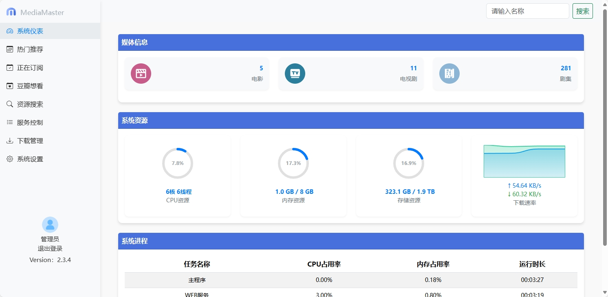

# MediaMaster V2

## 简介

影视自动化订阅管理系统（V2）。

**特别说明**

高清剧集网和高清影视之家，需自行注册用户进行测试。

本项目仅用于个人学习研究Python技术使用，请勿用于其他用途。


**管理界面预览：**



## 更新日志

查看 [更新日志](CHANGELOG.md) 以了解每个版本的详细变更记录。

## 许可证

本项目采用 [MIT License](LICENSE) 许可证。详情请参阅 [LICENSE](LICENSE) 文件。

## Docker 仓库地址

本项目Docker仓库： https://hub.docker.com/r/smysong/mediamaster-v2

## 快速开始

### 使用Docker Compose部署：
请替换volumes路径为实际路径。docker.1ms.run是docker镜像代理拉取地址，可以去除或更改为其他代理地址。
WEB管理信息：
> 默认端口：8888 \
> 使用浏览器访问：http://your-ip:8888 \
> 默认用户名：admin \
> 默认密码：password

**（单独部署） docker-compose.yml 如下：**
```
version: '3.8'
services:
  mediamaster:
    image: docker.1ms.run/smysong/mediamaster-mediamaster-v2:latest
    container_name: mediamaster
    environment:
      - UID=1000
      - GID=100
      - GIDLIST=100
    volumes:
      - /vol1/1000/Downloads:/Downloads
      - /vol1/1000/Torrent:/Torrent
      - /vol1/1000/Docker/mediamaster:/config
      - /vol1/1000/Media:/Media
    ports:
      - 8888:8888
    restart: always
    networks:
      media-network:

networks:
  media-network:
    driver: bridge
    enable_ipv6: true
    ipam:
      config:
        - subnet: 172.16.238.0/24
        - subnet: 2001:db8:1::/64
```
**（包含相关服务）docker-compose.yml 如下：**
```
version: '3.8'
services:
  emby:
    image: docker.1ms.run/amilys/embyserver:latest
    container_name: embyserver
    networks:
      media-network:
    environment:
      - UID=1000
      - GID=100
      - GIDLIST=100
    volumes:
      - /vol1/1000/Docker/emby/config:/config
      - /vol1/1000/Media:/Media
    ports:
      - 8096:8096
      - 8920:8920
    devices:
      - "/dev/dri/renderD128:/dev/dri/renderD128"
    restart: always

  mediamaster:
    image: docker.1ms.run/smysong/mediamaster-mediamaster-v2:latest
    container_name: mediamaster
    networks:
      media-network:
    environment:
      - UID=1000
      - GID=100
      - GIDLIST=100
    volumes:
      - /vol1/1000/Downloads:/Downloads
      - /vol1/1000/Torrent:/Torrent
      - /vol1/1000/Docker/mediamaster:/config
      - /vol1/1000/Media:/Media
    ports:
      - 8888:8888
    restart: always

  transmission:
    image: docker.1ms.run/linuxserver/transmission:latest
    container_name: transmission
    networks:
      media-network:
    environment:
      - PUID=1000
      - PGID=1000
      - TZ=Etc/UTC
      - TRANSMISSION_WEB_HOME= #optional
      - USER= #optional
      - PASS= #optional
      - WHITELIST= #optional
      - PEERPORT= #optional
      - HOST_WHITELIST= #optional
    volumes:
      - /vol1/1000/Docker/transmission:/config
      - /vol1/1000/Downloads:/downloads
      - /vol1/1000/Torrent:/watch
    ports:
      - 9091:9091
      - 51413:51413
      - 51413:51413/udp
    restart: unless-stopped

networks:
  media-network:
    driver: bridge
    enable_ipv6: true
    ipam:
      config:
        - subnet: 172.16.238.0/24
        - subnet: 2001:db8:1::/64
```

### CLI手动部署：
### 步骤 1: 拉取镜像
**首先，你需要从 Docker Hub 拉取镜像。假设你已经在一台安装了 Docker 的机器上：**


```
docker pull smysong/mediamaster-mediamaster-v2:latest
```


这将下载 smysong/mediamaster-mediamaster-v2:latest 镜像到本地。

### 步骤 2: 运行镜像
**接下来，你可以运行这个镜像。需要挂载一些配置文件或数据卷，你需要指定适当的挂载点。以下是一个示例命令，用于运行镜像，并挂载配置文件和数据卷：**


```
docker run -it --name mediamaster \
           -v /path/to/config:/config \
           -v /Media:/Media \
           -v /Torrent:/Torrent \
           -v /Downloads:/Downloads \
           smysong/mediamaster-mediamaster-v2:latest
```

在这个命令中：

> -it \
> 表示以交互模式运行容器，并分配一个伪TTY。
> 
> --name mediamaster \
> 给容器命名。
>  
> -v /path/to/config:/config \
> 在主机上新建config 目录挂载到容器的 /config 目录，用于存放配置文件。
>  
> -v /Media:/Media \
> 将主机上的媒体根目录挂载到容器的/Media目录，用于扫描本地媒体库文件和nfo文件。
>  
> -v /Torrent:/Torrent \
> 在主机上新建Torrent 目录挂载到容器的 /Torrent 目录，用于存放下载的种子文件。
> 
> -v /Downloads:/Downloads \
> 目录监控，将主机上下载器的下载目录挂载到容器/Downloads目录，可以实现自动转移并重命名下载完成的影片文件。
>  
> smysong/mediamaster-mediamaster-v2:latest \
> 是要运行的镜像名称。

```

**容器运行成功后可通过日志查看运行情况，并且配置qBittorrent或Transmission 等下载工具监听主机上的torrent目录，发现新的种子文件后将自动下载。**

### 步骤 3: 登录WEB管理
> 默认端口：8888 \
> 容器支持host模式或bridge模式 \
> 使用浏览器访问：http://your-ip:8888 \
> 默认用户名：admin \
> 默认密码：password
