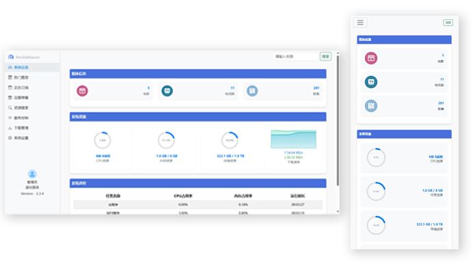
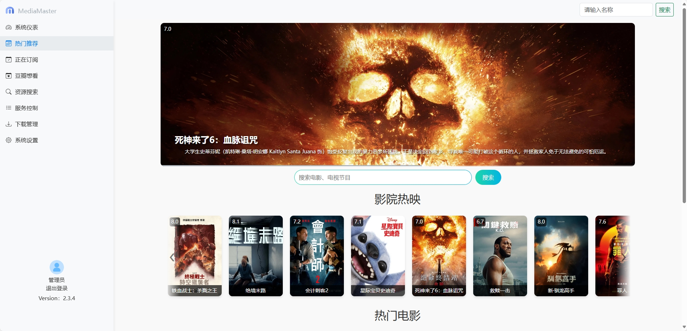

# MediaMaster V2

<div align="center">
  
</div>

> 🎬 **MediaMaster V2** 是一个开箱即用的影视自动化订阅管理系统。它基于 **Python** 构建，支持X86、ARM64架构，支持多站点资源订阅、自动化下载、媒体库管理，让你可以轻松管理和享受个人媒体内容。

<div align="center">


</div>

## 简介

影视自动化订阅管理系统（V2）。

**特别说明**

目前支持站点：BT影视、不太灵影视、观影、高清剧集网、高清影视之家。

支持下载器：迅雷、qBittorrent、Transmission

CPU架构支持：x86_64 、 ARM64

本项目仅用于个人学习研究Python技术使用，请勿用于其他用途。

**管理界面预览：**




## 帮助与反馈

<div align="center">
  
  <p>关注MediaMaster微信公众号获取最新资讯和技术支持，可通过公众号发送私信消息进行反馈以及获取技术支持</p>
</div>

## 更新日志

查看 [更新日志](CHANGELOG.md) 以了解每个版本的详细变更记录。

## 许可证

本项目采用 [MIT License](LICENSE) 许可证。详情请参阅 [LICENSE](LICENSE) 文件。

## Docker 仓库地址

本项目Docker仓库： https://hub.docker.com/r/smysong/mediamaster-v2

版本标签：

稳定版：latest `docker pull smysong/mediamaster-v2:latest`

测试版：beta `docker pull smysong/mediamaster-v2:beta`

## 配置文档

使用帮助文档： http://wiki.songmy.top:8080/web/#/686311457

## 快速开始

### 使用Docker Compose部署：
请替换volumes路径为实际路径。docker.1ms.run是docker镜像代理拉取地址，可以去除或更改为其他代理地址。
WEB管理信息：
> 默认端口：8888 \
> 使用浏览器访问：http://your-ip:8888 \
> 默认用户名：admin \
> 默认密码：password

**（单独部署） docker-compose.yml 如下：**
```
version: '3.8'
services:
  mediamaster:
    image: docker.1ms.run/smysong/mediamaster-v2:latest
    container_name: mediamaster
    environment:
      - UID=0 #如遇权限问题导致文件无法创建、修改等，请根据实际用户ID进行修改
      - GID=0 #如遇权限问题导致文件无法创建、修改等，请根据实际用户组ID进行修改
      - GIDLIST=0 #如遇权限问题导致文件无法创建、修改等，请根据实际用户附加组列表进行修改
      - TZ=Asia/Shanghai #设置中国时区
      - PORT=9999 # 可选配置：自定义设置容器内应用端口，不提供则使用默认8888端口运行
    volumes:
      - /vol1/1000/Media:/Media #媒体库目录，可根据实际进行修改
      - /vol1/1000/Downloads:/Downloads #下载目录，可根据实际进行修改
      - /vol1/1000/Torrent:/Torrent #可选配置:使用qBittorrent、Transmission、迅雷，无需配置种子监听目录。如使用其他下载器监听种子文件需进行配置
      - /vol1/1000/Docker/mediamaster:/config #可根据实际进行修改
      - /vol1/1000/Data:/Data #如需硬链接，需将媒体库目录和下载目录放置在同一挂载点下，同时删除上方媒体库目录和下载目录的配置，/Data为挂载点可根据实际需求进行名称修改
    ports:
      - 8888:8888
    restart: always
    networks:
      media-network:

networks:
  media-network:
    driver: bridge
    enable_ipv6: true #如本地网络无IPV6可设置为false
    ipam:
      config:
        - subnet: 172.16.238.0/24 #如可自行修改
        - subnet: 2001:db8:1::/64 #如本地网络无IPV6可删除
```
**（包含下载器）docker-compose.yml 如下：**
```
version: '3.8'
services:
  mediamaster:
    image: docker.1ms.run/smysong/mediamaster-v2:latest
    container_name: mediamaster
    networks:
      media-network:
    environment:
      - UID=0 #如遇权限问题导致文件无法创建、修改等，请根据实际用户ID进行修改
      - GID=0 #如遇权限问题导致文件无法创建、修改等，请根据实际用户组ID进行修改
      - GIDLIST=0 #如遇权限问题导致文件无法创建、修改等，请根据实际用户附加组列表进行修改
      - TZ=Asia/Shanghai #设置中国时区
      - PORT=9999 # 可选配置：自定义设置容器内应用端口，不提供则使用默认8888端口运行
    volumes:
      - /vol1/1000/Media:/Media #媒体库目录，可根据实际进行修改
      - /vol1/1000/Downloads:/Downloads #下载目录，可根据实际进行修改
      - /vol1/1000/Docker/mediamaster:/config #可根据实际进行修改
      - /vol1/1000/Data:/Data #如需硬链接，需将媒体库目录和下载目录放置在同一挂载点下，同时删除上方媒体库目录和下载目录的配置，/Data为挂载点可根据实际需求进行名称修改
    ports:
      - 8888:8888
    restart: always

  transmission:
    image: docker.1ms.run/linuxserver/transmission:latest
    container_name: transmission
    networks:
      media-network:
    environment:
      - PUID=0
      - PGID=0
      - TZ=Asia/Shanghai #设置中国时区
    volumes:
      - /vol1/1000/Docker/transmission:/config #可根据实际进行修改
      - /vol1/1000/Downloads:/downloads #可根据实际进行修改
    ports:
      - 9091:9091
      - 51413:51413
      - 51413:51413/udp
    restart: unless-stopped

networks:
  media-network:
    driver: bridge
    enable_ipv6: true #如本地网络无IPV6可设置为false
    ipam:
      config:
        - subnet: 172.16.238.0/24
        - subnet: 2001:db8:1::/64 #如本地网络无IPV6可删除
```

### CLI手动部署：
### 步骤 1: 拉取镜像
**首先，你需要从 Docker Hub 拉取镜像。假设你已经在一台安装了 Docker 的机器上：**


```
docker pull docker.1ms.run/smysong/mediamaster-v2:latest
```


这将下载 smysong/mediamaster-v2:latest 镜像到本地。

### 步骤 2: 运行镜像
**接下来，你可以运行这个镜像。需要挂载一些配置文件或数据卷，你需要指定适当的挂载点。以下是一个示例命令，用于运行镜像，并挂载配置文件和数据卷：**


```
docker run -it --name mediamaster \
           -v /path/to/config:/config \
           -v /Media:/Media \
           -v /Torrent:/Torrent \
           -v /Downloads:/Downloads \
           -e PORT=9999 \
           docker.1ms.run/smysong/mediamaster-v2:latest
```

在这个命令中：

> -it \
> 表示以交互模式运行容器，并分配一个伪TTY。
> 
> --name mediamaster \
> 给容器命名。
>  
> -v /path/to/config:/config \
> 在主机上新建config 目录挂载到容器的 /config 目录，用于存放配置文件。
>  
> -v /Media:/Media \
> 将主机上的媒体根目录挂载到容器的/Media目录，用于扫描本地媒体库文件和nfo文件。
>  
> -v /Torrent:/Torrent \
> 在主机上新建Torrent 目录挂载到容器的 /Torrent 目录，用于存放下载的种子文件。
> qBittorrent或Transmission已经支持通过API接口直接添加种子任务，迅雷远程设备通过专用程序监听种子，无需配置种子监听目录。如使用其他下载器监听种子文件时才需配置种子文件映射目录。
> 
> -v /Downloads:/Downloads \
> 目录监控，将主机上下载器的下载目录挂载到容器/Downloads目录，可以实现自动转移并重命名下载完成的影片文件。
>
> -e PORT=9999 \
> 自定义容器内运行端口，未提供则使用默认8888端口
>
> docker.1ms.run/smysong/mediamaster-v2:latest \
> 是要运行的镜像名称。

```

**容器运行成功后可通过日志查看运行情况，并且配置qBittorrent或Transmission 等下载工具监听主机上的torrent目录，发现新的种子文件后将自动下载。**

### 步骤 3: 登录WEB管理
> 默认端口：8888 \
> 容器支持host模式或bridge模式 \
> 使用浏览器访问：http://your-ip:8888 \
> 默认用户名：admin \
> 默认密码：password
